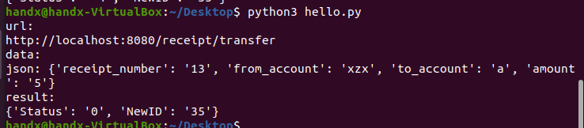

# BlockChain-FinalProject Server
## 实现功能
配合前端部分完成链相关的数据存储与处理，并按照相应请求返回数据
## 项目结构
```
├── build
│   ├── classes
│   │   └── java
│   │       └── main
│   │           └── org
│   │               └── fisco
│   │                   └── bcos
│   │                       └── asset
│   │                           ├── client
|   |
│   ├── resources
│   │   ├── main
│   │   │   ├── applicationContext.xml
│   │   │   ├── conf
│   │   │   │   ├── ca.crt
│   │   │   │   ├── node.crt
│   │   │   │   ├── node.key
│   │   │   │   ├── sdk.crt
│   │   │   │   └── sdk.key
│   │   │   ├── contract
│   │   │   │   ├── Asset.sol
│   │   │   │   └── Table.sol
│   │   │   └── log4j.properties
│   │   └── test
│   │       ├── applicationContext.xml
│   │       ├── conf
│   │       │   ├── ca.crt
│   │       │   ├── node.crt
│   │       │   ├── node.key
│   │       │   ├── sdk.crt
│   │       │   └── sdk.key
│   │       ├── contract
│   │       │   ├── Asset.sol
│   │       │   └── Table.sol
│   │       ├── contract.properties
│   │       └── log4j.properties
│   └── tmp
│       ├── compileJava
│       └── jar
│           └── MANIFEST.MF
├── build.gradle
├── dist
│   ├── apps
│   │   └── asset-app.jar
│   ├── asset_run.sh
│   ├── conf
│   │   ├── applicationContext.xml
│   │   ├── conf
│   │   │   ├── ca.crt
│   │   │   ├── node.crt
│   │   │   ├── node.key
│   │   │   ├── sdk.crt
│   │   │   └── sdk.key
│   │   ├── contract
│   │   │   ├── Asset.sol
│   │   │   └── Table.sol
│   │   ├── contract.properties
│   │   └── log4j.properties
│   ├── contract
│   │   ├── Asset.sol
│   │   └── Table.sol
│   ├── lib
│   │   ├── bcprov-jdk15on-1.60.jar
│   │   ├── commons-io-2.4.jar
│   │   ├── commons-lang3-3.1.jar
│   │   ├── commons-logging-1.2.jar
│   │   ├── fastjson-1.2.68.jar
│   │   ├── fisco-bcos-java-sdk-2.8.0-SNAPSHOT.jar
│   │   ├── gson-2.8.1.jar
│   │   ├── jackson-annotations-2.11.0.jar
│   │   ├── jackson-core-2.11.0.jar
│   │   ├── jackson-databind-2.11.0.jar
│   │   ├── javapoet-1.7.0.jar
│   │   ├── key-mini-toolkit-1.0.3-SNAPSHOT.jar
│   │   ├── log4j-1.2.17.jar
│   │   ├── lombok-1.18.6.jar
│   │   ├── netty-all-4.1.53.Final.jar
│   │   ├── netty-sm-ssl-context-1.2.0.jar
│   │   ├── picocli-3.6.0.jar
│   │   ├── slf4j-api-1.7.30.jar
│   │   ├── slf4j-log4j12-1.7.30.jar
│   │   ├── spring-aop-4.3.27.RELEASE.jar
│   │   ├── spring-beans-4.3.27.RELEASE.jar
│   │   ├── spring-context-4.3.27.RELEASE.jar
│   │   ├── spring-core-4.3.27.RELEASE.jar
│   │   ├── spring-expression-4.3.27.RELEASE.jar
│   │   ├── spring-tx-4.3.27.RELEASE.jar
│   │   ├── spring-web-4.3.27.RELEASE.jar
│   │   ├── spring-webmvc-4.3.27.RELEASE.jar
│   │   ├── tcnative-2.0.34.0.jar
│   │   └── toml4j-0.7.2.jar
│   └── log
│       ├── sdk.log
│       ├── sdk.log_2021012714.log
│       ├── sdk.log_2021012715.log
│       ├── sdk.log_2021012716.log
│       ├── sdk.log_2021012717.log
│       ├── sdk.log_2021012718.log
│       ├── sdk.log_2021012719.log
│       ├── sdk.log_2021012720.log
│       ├── sdk.log_2021012721.log
│       ├── sdk.log_2021012722.log
│       ├── sdk.log_2021012810.log
│       ├── sdk.log_2021012811.log
│       ├── sdk.log_2021012815.log
│       ├── sdk.log_2021012816.log
│       └── sdk.log_2021012817.log
├── gradle
│   └── wrapper
│       ├── gradle-wrapper.jar
│       └── gradle-wrapper.properties
├── gradlew
├── gradlew.bat
├── runserver.sh
├── src
│   ├── main
│   │   ├── java
│   │   │   └── org
│   │   │       └── fisco
│   │   │           └── bcos
│   │   │               └── asset
│   │   │                   ├── client
│   │   │                   │   ├── AssetClient.java
│   │   │                   │   ├── ReceiptClient.java
│   │   │                   │   └── Server.java
│   │   │                   └── contract
│   │   │                       ├── Asset.java
│   │   │                       ├── Finance.java
│   │   │                       ├── HelloHandx.java
│   │   │                       ├── HelloWorld.java
│   │   │                       ├── KVTableTest.java
│   │   │                       ├── Receipt.java
│   │   │                       ├── ShaTest.java
│   │   │                       ├── Table.java
│   │   │                       └── TableTest.java
│   │   └── resources
│   │       ├── applicationContext.xml
│   │       ├── conf
│   │       │   ├── ca.crt
│   │       │   ├── node.crt
│   │       │   ├── node.key
│   │       │   ├── sdk.crt
│   │       │   └── sdk.key
│   │       ├── contract
│   │       │   ├── Asset.sol
│   │       │   └── Table.sol
│   │       └── log4j.properties
│   └── test
│       └── resources
│           ├── applicationContext.xml
│           ├── conf
│           │   ├── ca.crt
│           │   ├── node.crt
│           │   ├── node.key
│           │   ├── sdk.crt
│           │   └── sdk.key
│           ├── contract
│           │   ├── Asset.sol
│           │   └── Table.sol
│           ├── contract.properties
│           └── log4j.properties
└── tool
    └── asset_run.sh
```

## 项目结构说明
主体还是根据官网教程[开发第一个区块链应用](https://fisco-bcos-documentation.readthedocs.io/zh_CN/latest/docs/tutorial/sdk_application.html)编写，用到的合约主要有自带的`Asset`以及小组成员编写的`Receipt`

```
//Asset 表结构
// 资产管理表, key : account, field : asset_value
        // |  资产账户(主键)      |     资产金额       |
        // |-------------------- |-------------------|
        // |        account      |    asset_value    |
        // |---------------------|-------------------|
        //


//Receipt 表结构
// 收据管理表, key : id, field : debtor_account debtee_account amount
        // |单号（主键）|债务人         | 债主          | 金额  |
        // |----------|--------------|--------------|------|
        // |   id     |debtor_account|debtee_account|amount|
        // |----------|--------------|--------------|------|

```

### 链端

合约对象`Asset`和`Receipt`是负责上述两张表的增删改查，说白了链端就是负责存储数据的，而这两个对象提供了对数据的操作，但这两个由于是`sol2java`直接生成的，接口使用起来不那么友好


### 服务器端

服务器使用`Java`语言编写，使用了JDK自带的轻量级服务器`com.sun.net.httpserver.HttpServer`，虽说原来代码直接生成的是`Spring`以及`Bean`容器，使用`SpringMVC`可能会比较好交互，但因为不太熟悉该框架，增加学习成本，且并不需要复杂的功能，所以选择原生的服务器框架；

`Server.java`负责整个服务器，包括路由以及处理函数，还整合上述两个对象来进行数据的操作

`AssetClient.java`和`ReceiptClient.java`负责与上述链端的两个对象进行交互，负责将对应数据的操作简化，给服务器提供更友好的接口


## API 文档
### 账户注册 register POST
* 请求
	* name string
	* password string
	* asset_value int
* 返回
	* state uint
### 账户登录 login POST
* 请求
	* name string
	* password string
* 返回
	* state
### 资产查询 asset POST
* 请求
	* name string
* 返回
	* asset_value int
### 债券开具 make POST
* 请求
	* receipt_number int
	* debtor_name string
	* debtee_name string
	* amount int
* 返回
	* state uint

### 债券转移 transfer POST
* 请求
	* from_account string
	* to_account string
	* amount int
* 返回
	* 发起者被转移的债券单号
	* 转移后，生成的两个债券单号（被拆分后，如有剩余产生一个新的债券，然后转移关系会产生一个债券）

### 债券查询 select POST
* 请求
	* id string
* 返回
	* state uint
	* content tuple<>

### 债券人相关查询 selectAccount POST
* 请求
	* account string
* 返回
	* state uint
	* array ArrayList

## 功能说明及示例，测试使用python-requests
### 用户注册


### 账户登录


### 资产查询


### 债券开具


### 债券转移



### 债券查询


### 债券人相关查询


## 运行过程

* 运行链端
	* 
* 编译整个项目
	* 
* 运行服务器
	* 
